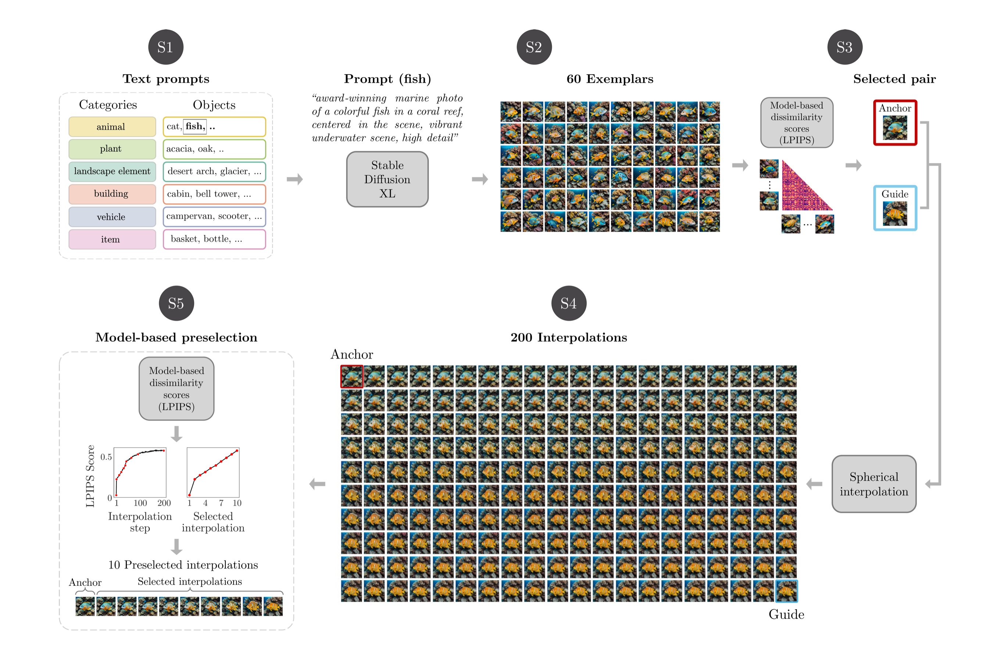

# stable-diffusion-stimuli

Code for stimulus generation in:

> Pettini, L., Bogler, C., Doeller, C., & Haynes, J.-D. (2025). Synthesis and perceptual scaling of high-resolution naturalistic images using Stable Diffusion. *Behavior Research Methods, 58*(1), 24.
> https://doi.org/10.3758/s13428-025-02889-8

---

## Background

A central challenge in visual cognition research is to design naturalistic
stimuli that are both ecologically valid and experimentally controlled.
Standard approaches based on existing image databases offer limited control
over fine-grained perceptual similarity within a stimulus class. Study 1
addresses this problem using deep generative modelling.

In Study 1, we developed a methodological approach based on **Stable Diffusion
XL** to synthesise a new set of experimental stimuli in a controlled way. The
stimuli are naturalistic *object-scenes*: images of a central object embedded
in a coherent scene, generated across a wide range of categories. For each
object-scene, the method produces a set of variations ordered on a perceptual
gradient. This makes the stimuli suitable for threshold-level perceptual
discrimination tasks, while preserving the perceptual and semantic richness
needed for subsequent memory experiments.

The final corpus comprises **108 object-scenes** spanning **six semantic
categories**: animals, plants, landscape elements, buildings, vehicles, and
items. Each object-scene is represented by a set of 10 ordered variations that
preserve semantic identity while differing in fine perceptual detail.

Study 1 as a whole comprised three stages:

- **Stage 1** — synthesis and model-based perceptual scaling of the stimulus set
- **Stage 2** — psychophysical validation via similarity judgements
- **Stage 3** — behavioural validation in a delayed match-to-sample task

This repository is specifically about **Stage 1**. It contains the pipeline
used to generate the stimulus set and derive the ordered image continua that
were subsequently validated in Stages 2 and 3.

---

## Study 1, Stage 1

The Stage 1 pipeline follows five conceptual steps (S1–S5), illustrated below.



*Figure adapted from Pettini et al. (2025).*

**(S1)** A text prompt is designed for each of the 108 object-scenes (e.g., *"award-winning marine photo of a colorful fish in a coral reef, centered in the scene, vibrant underwater scene, high detail"*).

**(S2)** 60 image exemplars are generated per object-scene using SDXL base + refiner, each from a distinct random noise seed, ensuring within-scene semantic consistency.

**(S3)** Pairwise LPIPS (Learned Perceptual Image Patch Similarity) distances are computed among all 60 exemplars. A pair of images — an *anchor* (most typical) and a *guide* (most typical near-neighbour) — is selected as the endpoints for interpolation.

**(S4)** 200 image variations are generated by spherical linear interpolation (SLERP) between the anchor and guide noise latents in the SDXL latent space.

**(S5)** LPIPS scores relative to the anchor are used to identify 10 interpolated images whose perceptual distances are approximately linearly spaced, yielding the final ordered set.

At the methodological level, Stage 1 proceeds as follows:

- **(S1)** define one text prompt for each object-scene
- **(S2)** generate 60 exemplars per object-scene with Stable Diffusion XL
- **(S3)** use LPIPS to select an anchor-guide pair that is representative and perceptually similar
- **(S4)** generate 200 interpolated variations between the anchor and the guide
- **(S5)** use LPIPS again to select 10 images ordered on an approximately linear perceptual scale

In the codebase, these steps are implemented through a sequence of scripts rather than a strict one-script-per-step mapping. The current implementation is organised as:

- `pipe_01_generate_design.py`
- `pipe_02a_generate_images.py`
- `pipe_02b_exclude_images.py` (optional manual exclusion step)
- `pipe_03_compute_similarities.py`
- `pipe_04a_select_pairs.py`
- `pipe_04b_collect_selected_pairs.py` / `pipe_04c_change_pair.py` / `pipe_04d_collect_final_pairs.py` (manual review helpers around pair selection)
- `pipe_05_generate_interpolations.py`
- `pipe_06_compute_similarities_interpols.py`
- `pipe_07_select_interpolations.py`
- `pipe_08a_collect_stimuli.py`
- `pipe_08b_create_strips.py`

The later scripts mainly support the implementation of **S3–S5**, including
manual quality control, interpolation generation, interpolation scoring, and
final frame selection.

For exact file and folder behavior, see [PIPELINE_LOGIC.md](./PIPELINE_LOGIC.md).

### Helper modules

| File | Description |
|---|---|
| `config.py` | Central path configuration; reads all run-specific identifiers from `.env` |
| `utils.py` | Collision-free ID generation and name abbreviation |
| `plot_utils.py` | LPIPS score visualisation (heatmaps, line plots) |
| `prompts.py` | Alternative prompt definitions (exported to `prompts.json`) |

### Diagnostics and inspection

| Folder | File | Description |
|---|---|---|
| `diagnostics/` | `test_generation.py`, `test_generation_v2.py` | Test SDXL generation reproducibility |
| `diagnostics/` | `test_interpolations.py` | Test the interpolation pipeline for a single object |
| `diagnostics/` | `test_slerp.py` | pytest unit tests for the SLERP function |
| `diagnostics/` | `monitor_gpu.py` | GPU thermal monitor for long generation runs |
| `inspection/` | `collect_images.py` | Copy all anchor images into a flat directory for browsing |
| `inspection/` | `make_grids.py` | Create image grids for anchor image inspection |
| `inspection/` | `make_strips.py` | Create strips sorted by LPIPS score |

---

## Setup

### 1. Install dependencies

```bash
pip install -r requirements.txt
```

### 2. Download models

The pipeline uses:
- [Stable Diffusion XL Base 1.0](https://huggingface.co/stabilityai/stable-diffusion-xl-base-1.0)
- [Stable Diffusion XL Refiner 1.0](https://huggingface.co/stabilityai/stable-diffusion-xl-refiner-1.0)
- A LoRA weight file (`xl_more_art-full_v1.safetensors`) placed in a `LoRAs/` directory at the repository root

Models are loaded from Hugging Face on first run (or from local cache).
The generation scripts assume a CUDA-capable GPU; they also call
`enable_xformers_memory_efficient_attention()`, so `xformers` should be
installed in the environment used for image generation.

### 3. Configure paths

Copy `.env.example` to `.env` and set `BASE_DIR`:

```bash
cp .env.example .env
```

```
BASE_DIR=/path/to/your/output/directory
```

`BASE_DIR` is the only variable you need to set manually at startup. The other
pipeline handoff variables (`STIM_SET_NAME`, `DESIGN_FILE`,
`SELECTED_PAIRS_FILE`, `INTERPOL_DIR_NAME`) are written to `.env`
automatically as stages complete.

If you want to exclude poor anchor images after inspection, you may optionally
create:

- `BASE_DIR/generation_YYYYMMDD_HHMMSS/excluded_images.csv`

This is a user-provided input for `pipe_02b_exclude_images.py`, not a file the
pipeline creates by itself.

---

## Running the pipeline

Run all scripts as modules from the **repository root** (the directory containing `naturalistic_image_synthesis/`):

```bash
# Stage 1 — create stimulus design
python -m naturalistic_image_synthesis.pipeline.pipe_01_generate_design

# Stage 2 — generate anchor images (GPU required)
python -m naturalistic_image_synthesis.pipeline.pipe_02a_generate_images

# Optional: after visually inspecting anchor images, create
# BASE_DIR/generation_YYYYMMDD_HHMMSS/excluded_images.csv and run:
python -m naturalistic_image_synthesis.pipeline.pipe_02b_exclude_images

# Stage 3 — compute pairwise LPIPS similarity scores (GPU required)
python -m naturalistic_image_synthesis.pipeline.pipe_03_compute_similarities

# Stage 4a — select interpolation endpoint pairs
python -m naturalistic_image_synthesis.pipeline.pipe_04a_select_pairs

# Stage 4b–d — manual review (inspect composites, swap pairs if needed)
python -m naturalistic_image_synthesis.pipeline.pipe_04b_collect_selected_pairs
python -m naturalistic_image_synthesis.pipeline.pipe_04c_change_pair
python -m naturalistic_image_synthesis.pipeline.pipe_04d_collect_final_pairs

# Stage 5 — generate interpolation sequences (GPU required)
python -m naturalistic_image_synthesis.pipeline.pipe_05_generate_interpolations

# Stage 6 — compute pairwise LPIPS scores for interpolated frames (GPU required)
python -m naturalistic_image_synthesis.pipeline.pipe_06_compute_similarities_interpols

# Stage 7 — select 10 representative frames per sequence
python -m naturalistic_image_synthesis.pipeline.pipe_07_select_interpolations

# Stage 8 — collect and resize final stimuli
python -m naturalistic_image_synthesis.pipeline.pipe_08a_collect_stimuli

# Optional: create visual inspection strips
python -m naturalistic_image_synthesis.pipeline.pipe_08b_create_strips
```

Multi-GPU parallelisation is handled automatically in stages 2, 3, and 5.

For the exact directory structure and per-stage outputs, see
[PIPELINE_LOGIC.md](./PIPELINE_LOGIC.md).

---

## Output structure

```
BASE_DIR/
└── STIM_SET_NAME/
    ├── anchor_images/                          # Raw generated images
    ├── similarity_scores_anchors/              # LPIPS matrices for anchors
    ├── interpolations_*/                       # Interpolation sequences
    ├── selected_interpolations_*/              # Schematic: code uses selected_{INTERPOL_DIR_NAME}/
    └── stimulus_set_from_interpolations_*/     # Final resized stimuli

naturalistic_image_synthesis/
└── stimulus_set_designs/                       # Design DataFrames (objects × seeds × prompts)
```

This is intentionally schematic. For exact filenames and handoff variables, see
[PIPELINE_LOGIC.md](./PIPELINE_LOGIC.md).

---

## Citation

If you use this code or the stimulus set, please cite:

```bibtex
@article{pettini2025synthesis,
  title     = {Synthesis and perceptual scaling of high-resolution naturalistic images using {Stable Diffusion}},
  author    = {Pettini, Leonardo and Bogler, Carsten and Doeller, Christian and Haynes, John-Dylan},
  journal   = {Behavior Research Methods},
  volume    = {58},
  number    = {1},
  pages     = {24},
  year      = {2025},
  doi       = {10.3758/s13428-025-02889-8}
}
```

---

## Affiliation

Developed at the [Haynes Lab](https://www.hayneslab.de), Berlin Center for Advanced Neuroimaging (BCAN), Humboldt-Universität zu Berlin, as part of the dissertation *Assessing Neural Representations of Naturalistic Images Across Perception and Memory Using Deep Generative Modelling* (Leonardo Pettini, 2025).
